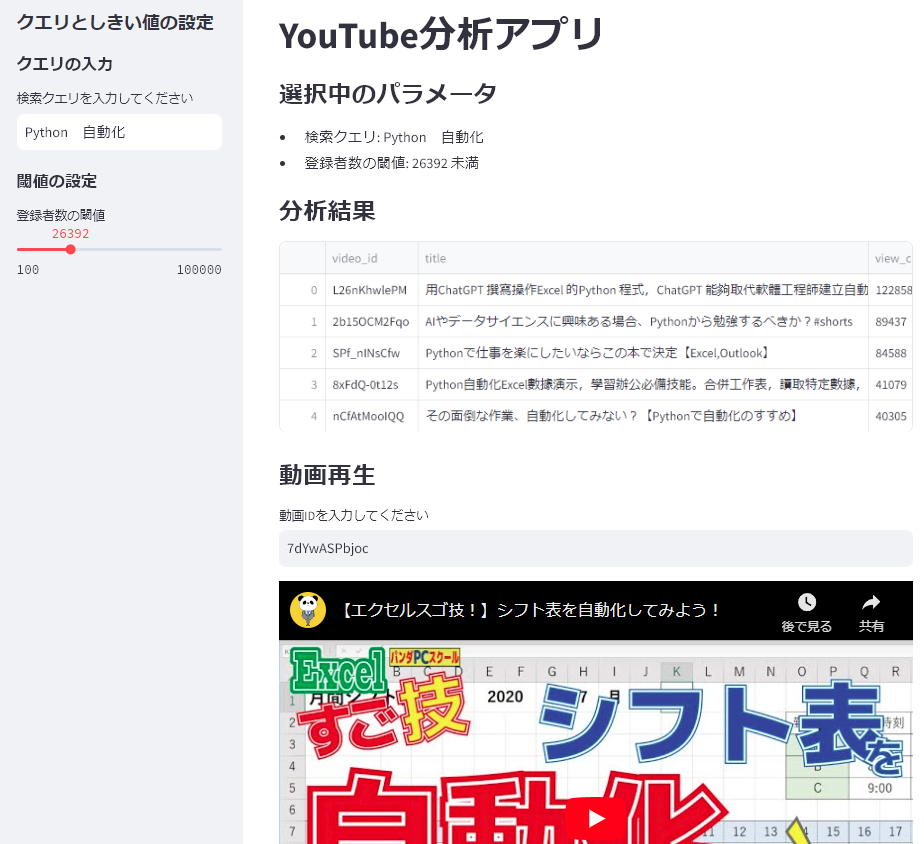

# GCPのAPI、Stremlit Sharingを使ったwebアプリ
### アプリ画面

* Streamlit Sharingサービスでドメイン取得してクラウドにUpしようとするとmoduleのインポートに失敗しているようで（以下のメッセージ）、デプロイできませんでした。

  ```
  File "/home/adminuser/venv/lib/python3.9/site-packages/streamlit/runtime/scriptrunner/script_runner.py", line 534, in _run_script
      exec(code, module.__dict__)
  File "/mount/src/youtube-vidanal-app/app.py", line 1, in <module>
      from apiclient.discovery import build
  ```
* localhostでは表示でき、GCPのAPIも使えているようでした。それが上図のキャプチャです。
* 後日別のStreamlit系で今回のモジュールないタイプのwebアプリ作ってデプロイしてみようと思います。
### 理解したこと
以下のことが経験できました。キャプチャも取りためているので、別日にUpしていきたいと思います。
* GCPのアカウント登録
* GCP（Google）が提供している各種APIを使う流れ（APIキーの取得方法）
* サービスアカウントの作成方法（AWSでいうところのRoleみたいな使い方するイメージ）
* サービスアカウントの認証情報をjsonでDLし、APIキーを記入したうえで、アプリケーションの.py内に読み込ませる記述を入れる流れ
* GCPの公式docの読み方、特に各種APIの公式docのあさり方
### 感想
* APIを使ったアプリ開発を体験してみて、漠然としたAPIのイメージの解像度が上がりました
* GCP APIを利用した操作は、`List,Get,Create,Update,Delete`があり、HTTPメソッドと対応しているということがわかり、直感的にわかりやすかったです
* GCPのマネコンでの操作はAWSよりも直感的というかユーザーフレンドリーな印象でした
* GCPの公式docはAWSよりもわかりやすい印象でした


以上